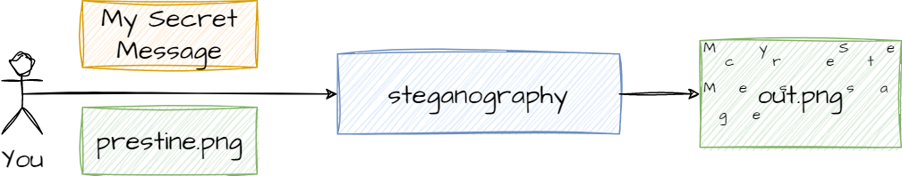
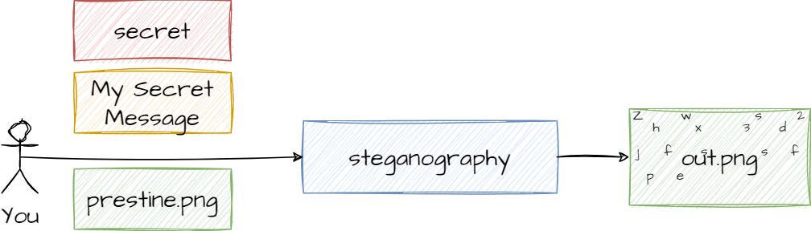
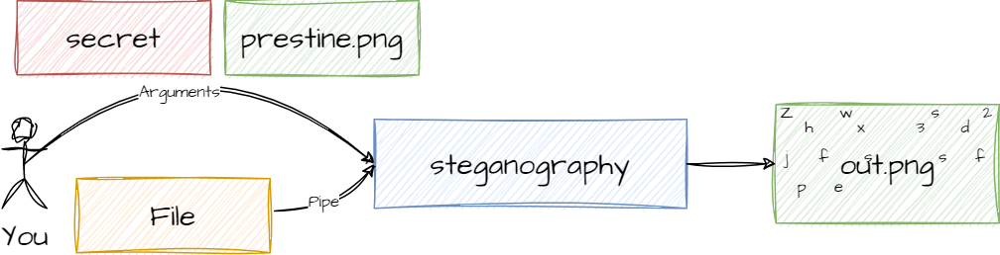
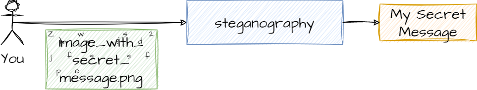
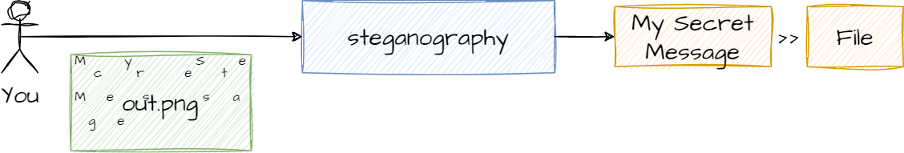
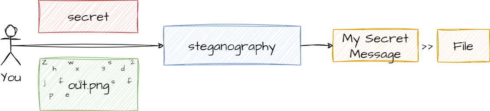

# Steganography - Hidding Message into Image

[](https://github.com/MrDesjardins/steganographyrs)
[](https://crates.io/crates/steganographyrs)
[](https://docs.rs/steganographyrs/latest/steganographyrs)
[](https://github.com/MrDesjardins/steganographyrs/actions/workflows/rust.yml)
[](https://codecov.io/gh/MrDesjardins/steganographyrs)

steganographyrs is a Rust library that inject a message into an image. 


The word steganography means to hide something. The definition is very high level. Hence, it has a variety of ways to accomplish the goal of steganography. This library relies on the least significant bits.

# What is Least Significant Bits?

1) [Blog Post about using the least significant bits](https://patrickdesjardins.com/blog/what-is-steganography-how-to-hide-text-in-image)

# Consumer of the Library

## Install

```sh
cargo add steganographyrs
```

# Consumer of the CLI

You must have some arguments like the mode you want to execute (encrypt, decrypt). If you want to use AES encryption, you need to provide your secret password with `-p`.

You can see all options by using `--help` or `-h` 

```sh
steganographyrs --help
// or in dev:
cargo run -- help
```

## Hide a String without Encryption in an Image



```sh
steganographyrs -e inject -m "My Secret Message" -i testAssets/prestine.png -o out.png
// or in dev:
cargo run -- -e inject -i testAssets/prestine.png -o out.png -m "My Secret Message"
```

## Hide an Encrypted String in an Image



```sh
steganographyrs -e inject -p secret -m "My Secret Message" -i testAssets/prestine.png -o out.png
// or in dev:
cargo run -- -e inject -p secret -i testAssets/prestine.png -o out.png -m "My Secret Message"
```

## Hide an String from Standard Input, Encrypt the message into an Image



```sh
echo "My Secret Message" | steganographyrs -e inject -p secret -i testAssets/prestine.png -o out.png
```
## Hide an String from an external via by using the Standard Input, Encrypt the message into an Image


```sh
cat testAssets/message1.txt | steganographyrs -e inject -p secret -i testAssets/prestine.png -o out.png
// or in dev:
cat testAssets/message1.txt | cargo run -- -e inject -i testAssets/prestine.png -o out.png 
```

## Recover a String in an Image in the Terminal Standard Output


```sh
steganographyrs -e extract -i testAssets/image_with_secret_message.png
// or in dev:
cargo run -- -e extract -i testAssets/image_with_secret_message.png
```
The result is sent into the standard output

## Recover an Encrypted String from an Image in the Terminal Standard Output



```sh
steganographyrs -e extract -p secret -i testAssets/image_with_secret_message.png
// or in dev:
cargo run -- -e extract -p secret -i testAssets/image_with_secret_message.png
```

## Recover a String from an Image Message into a File




```sh
steganographyrs -e extract -p secret -i testAssets/image_with_secret_message.png >> message.txt
// or in dev:
cargo run -- -e extract -p secret -i testAssets/image_with_secret_message.png >> message.txt
```

## Recover an Encrypted String in an Image Message into a File



```sh
steganographyrs -e extract -p secret -i testAssets/image_with_secret_message.png >> message.txt
// or in dev:
cargo run -- -e extract -p secret -i testAssets/image_with_secret_message.png >> message.txt
```

# Consumer of the Library?

You use the entry function called `steganography` and you can choose the option you want to inject and extract a message by encrypting or not your message into an input image to an output message.

```rust
use steganographyrs::steganography;
let result = steganography(steganography_option); // Result is an option that is only filled on the extraction
```

# As a Developer of the Library

## What to Install?

You need to install the right toolchain:

```sh
rustup toolchain install stable
rustup default stable
```

To perform test coverage you need to install

```sh
cargo install grcov
rustup component add llvm-tools-preview
```

To generate benchmark plots you need to install GnuPlot

```sh
sudo apt update
sudo apt install gnuplot

# To confirm that it is properly installed:
which gnuplot
```

## Execute

To get all options using `cargo run`:
```
cargo run -- -help
```

## Tests

```sh
cargo test
```

## Tests Coverage

You must install few components before running coverage:

```sh
cargo install grcov
rustup component add llvm-tools-preview
```

Then, you can run:

```sh
./coverage.sh
```

Further explanation in the [Mozilla grcov website](https://github.com/mozilla/grcov)

## Documentation
The documentation is generated from the source code using:

```sh
cargo doc --open  -document-private-items
```

## Testing CLI

All commands for the user works but instead of using 

```
steganographyrs -e true -p secret -m "My Secret Message" -i testAssets/prestine.png -o out.png
```

You need to use:

```
cargo run -- -e true -p secret -m "My Secret Message" -i testAssets/prestine.png -o out.png
```

# Benchmark

```sh
cargo bench
```

# Publishing

## Test the Cargo Content

```sh
cargo package --allow-dirty
```

Then go to `steganographyrs/target/package/` to see the content

## Push a new Cargo Package

```sh
cargo login
cargo publish --dry-run
cargo publish
```

